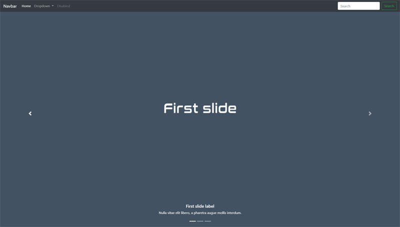

# Bootstrap Basic Theme
> Simple template responsive with full carousel & fancyBox Gallery.

The image is of the first version of the template.

## Usage example

You are free to save, share, and use this project.

_For more examples and usage, please refer to the [Bootstrap Documentation][bootstrap], [Jquery Documentation][jquery] or [Fancybox Documentation][fancybox]._

## Release History

* 0.1
    * ADD: jQuery v3.3.1
    * ADD: Popper JS
    * ADD: Bootstrap v4.1.3
    * FIX: Carousel full responsive
    * FIX: Footer Sticky
    * Work in progress

* 0.2
    * ADD: fancyBox v3.4.1
    * ADD: Sections Services, Gallery and Contact
    * ADD: Directory img/gallery/
    * ADD: gallery.json
    * ADD: Controls to fancyBox Gallery
    * FIX: Responsive Design
    * Work in progress

* 0.3
    * ADD: jQuery Easing v1.4.1
    * ADD: Filter images by tags
    * ADD: Active class to navbar items on scroll
    * FIX: Closes responsive menu when a scroll trigger link is clicked
    * Work in progress

<!-- Markdown link & img dfn's -->
[bootstrap]: https://getbootstrap.com/docs/4.1/getting-started/introduction/
[jquery]: https://jquery.com/
[fancybox]: https://fancyapps.com/
